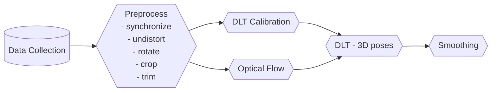
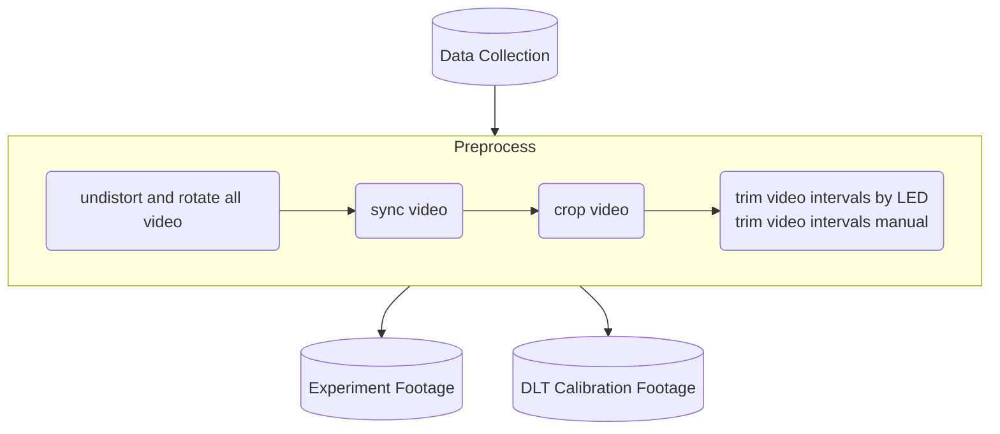
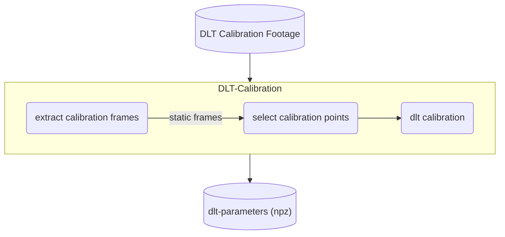
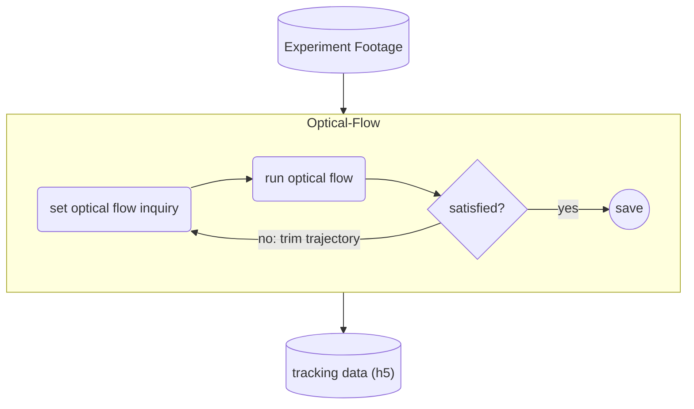
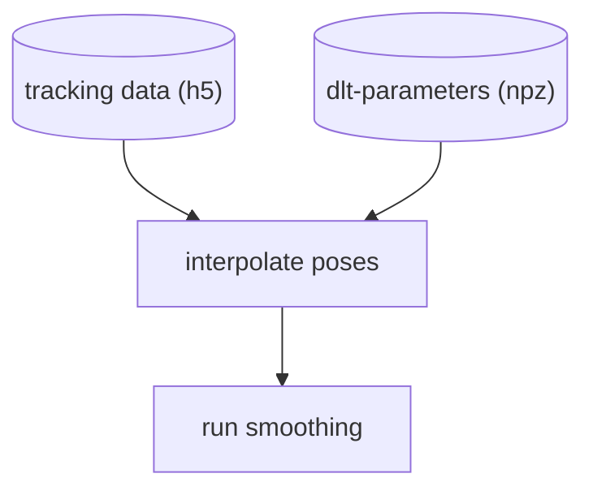

# A physics-informed, vision-based method to reconstruct all deformation modes in slender bodies

[Paper (arXiv)](https://arxiv.org/abs/2109.08372) - ICRA 2022

> The code to reproduce the result for the paper is in [v0.1](https://github.com/GazzolaLab/BR2-vision-based-smoothing/tree/v0.1). The current version is under further development for utilization. While we are trying our best to keep the code back-compatible, past version might require installing deprecated packages and python.

[Demo Data](https://uofi.box.com/s/7wjf2wrtq6ykn5km7umng4mf6reme3sq)

## How to install

```bash
cd <path to the repository>
git clone https://github.com/GazzolaLab/BR2-vision-based-smoothing.git
cd BR2-vision-based-smoothing
# <optional> activate virtual environment
pip install .
```

### Unit-Tests

```bash
cd BR2-vision-based-smoothing
# <optional> activate virtual environment
pytest
```

## Requirements

All the tools are developed using Python3.9 and openCV. We recommend installing dependencies using `poetry`.
To visualize the data, we used `ffmpeg` tool to render video.

- [PyElastica](https://github.com/GazzolaLab/PyElastica)
_(The PyQt may not operate in some OS environment)_

## Publication

Kim, Chang, Shih, Uppalapati, Halder, Krishnan, Mehta and Gazzola <strong>A physics-informed, vision-based method to reconstruct all deformation modes in slender bodies</strong>, IEEE ICRA 2022
```
@inproceedings{kim2022smoothing,
title = "A physics-informed, vision-based method to reconstruct all deformation modes in slender bodies",
author = "Kim, {Seung Hyun} and Chang, {Heng Sheng} and Shih, {Chia Hsien} and Uppalapati, {Naveen Kumar} and Udit Halder and Girish Krishnan and Mehta, {Prashant G.} and Mattia Gazzola",
year = "2022",
doi = "10.1109/ICRA46639.2022.9811909",
series = "Proceedings - IEEE International Conference on Robotics and Automation",
booktitle = "2022 IEEE International Conference on Robotics and Automation, ICRA 2022",
}
```

## How To Use

To process the video data, check out section [(Calibration Steps)](#calibration-steps) for camera calibration and [(Optical Flow: Data Point Tracking)](#optical-flow-data-point-tracking) for the point tracking.
To process reconstruction (smoothing) algorithm, check out section [(Reconstruction (Smoothing))](#reconstruction-smoothing).

### Typical Workflow




#### Preprocessing Video

> Order matters

Anything inside the box can be run as a `cli` command.




#### DLT Calibration



#### Optical Flow



#### Smoothing



### Path Configuration

All data paths and output paths can be changed in `config.py` file.

### Reconstruction (Smoothing)

1. Check that the posture data file is inside the folder named `data` and the data file name is `<Keyword>.npz`.
* Default Sample `<Keyword>` Options: `bend` / `twist` / `mix` / `cable`.
* Note that if you have your own data, please properly modify the `delta_s_position` variable in the `main()` function of the `run_smoothing.py` file.
* The `delta_s_position` parameter decides the distance between each marker in the rest state of the soft arm.

2. Run the smoothing algorithm

``` bash
python run_smoothing.py --problem <Keyword>
```

3. Once the algorithm is completed, the processed data will then be stored in the `result_data` folder and is named as `<Keyword>.pickle`.

4. To visualize the result, run
``` bash
python visualization.py --problem <Keyword>
```
This will create a visualization video named `<Keyword>.mov` and a folder named `frames` with all frame results in it.

### Calibration Steps

> Following calibration stages does not include the fish-eye warp correction.

1. Select DLT calibration points

Select calibration point for all calibration frames in the directory.
Save the points in camera (each) coordinate and lab-coordinate.

```bash
run_select_calibration_points --help  #  for more information
run_select_calibration_points -f dlt-calib
```

The red mark on reference point indicates 'locked' status.
Using locked points, we estimate the remaining reference locations with inverse DLT.
Locked points does not move after the interpolation; only blue points are re-evaluated and re-located.
Each points have unique label that is used to interpolate the true coordinate.

- Left Click: Select point
    - Control-Left Click: Delete point
- Right Click: Lock point
    - Control-Right Click: Lock all points
- Key 'h' or 'H': Show help
- Key 'D' or 'd': Delete last coordinate
- Key 'b': Label points
- Key 'p': Interpolate using planar(2D) DLT (At least 4 locked points are required)
- Key 'P': Use Harry's corner detection.
- Key 'o': Use 3D DLT (from other reference frame images)
- Key 's': Save
- 'Enter,' 'Space,' 'ESC': Complete

2. Calibration

```bash
dlt_calibration
```

Read all 2D calibration points and determines the camera parameters.
Calibration configuration is saved.

3. Check Calibration Error

```bash
python calibration_error.py
```

### Optical Flow: Data Point Tracking

1. Initial Reference Point

```bash
python add_initial_flow_point.py -h
python add_initial_flow_point.py --camid <camera id> --runid <run id>
```

The script is used to select multiple initial flow position and to label them.
The desire window of flow can be determined using the optional argument `start_frame` and `end_frame` (default is from first to last frame).
Multiple flow position can be selected.

- Left Click: Click the pixel to label
- Right Click: Zoom-in
    - Left Click: Reselect the point
    - Right Click: Return to original point
    - Key 'a': accept the selection
    - Key 'd': decline the selection
- Key 'p': Print the selection
- Key 'd': Delete the last seletion
- Key 'c': Complete

2. Optical Flow

```bash
python run_optical_flow.py --camid <camera id> --runid <run id>
```

Run optical flow given the initial poiition selected from `add_initial_flow_point.py`.
The script export the result in a video(mp4) format.

3. DLT Process

```bash
python process_dlt.py --runid 1 
```

Convert each tracked point to 3d point using DLT, and save in 'runRUNID-position.npz' file.

4. Interpolate Cross-Section Data

```bash
python data_augment_cross_section.py
```

### Overlay Result

```bash
python overlay_smoothing.py
```

Plot simulated data points on camera space.
Careful choice of axis is required

### Utility Scripts

- dlt.py
    - Contain all DLT related methods.
- undistort.py
    - Contain undistortion related methods.

### Video Pre-processing

Following preprocessing scripts are included.

- undistort_rotate_video: Rotate and undistort the video, and save it as mp4 with the name appended with `_undistort.mp4`
    - Calibration file must be included.
    - For detail, run `undistort_rotate_video --help`
- extract_frames_from_video: Save frames from the video as png files. Frames are selected based on their similarity to the previous frames.
    - Useful to extract calibration frames from the calibration video.
    - User can use roi to select the region of interest, during similarity comparison.
    - Output png file is compressed.
    - For detail, run `extract_frames_from_video --help`
- trim_video_intervals.py: detect led and trim the video based on the led.
    - Input path is specified in `PATHS/undistorted_video_path`
    - Output path is specified in the config file: `PATHS/preprocessed_footage_video_path`
    - For detail, run `trim_video_intervals.py --help`

