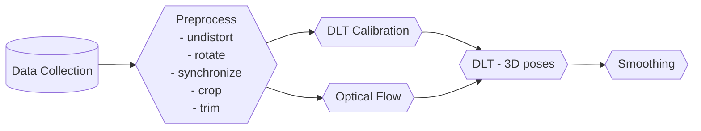
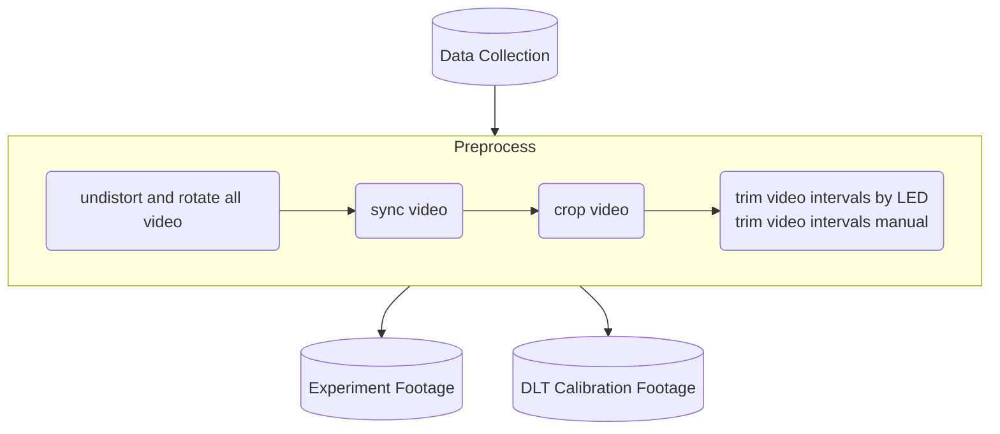
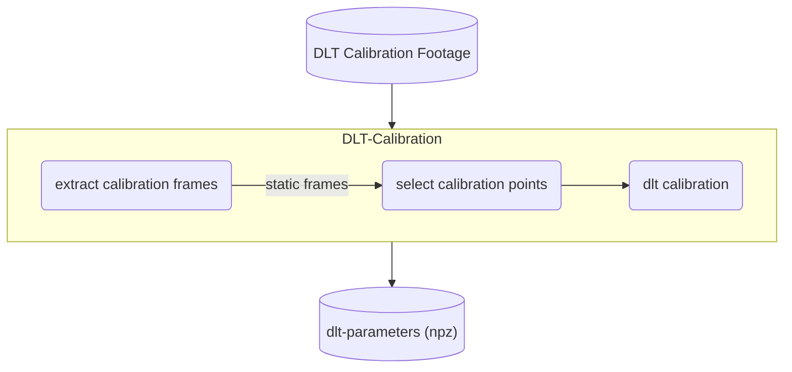
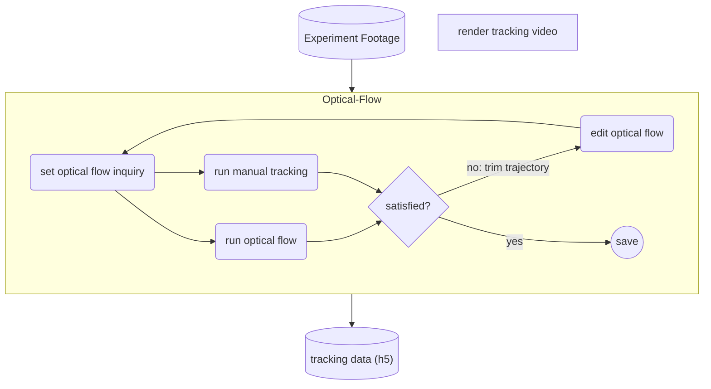
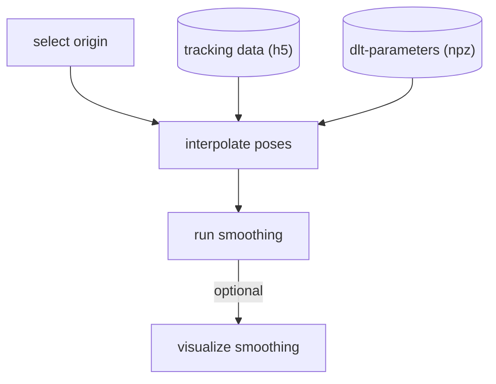

# A physics-informed, vision-based method to reconstruct all deformation modes in slender bodies

[Paper (arXiv)](https://arxiv.org/abs/2109.08372) - ICRA 2022

> The code to reproduce the result for the paper is in [v0.1](https://github.com/GazzolaLab/BR2-vision-based-smoothing/tree/v0.1). The current version is under further development for utilization. While we are trying our best to keep the code back-compatible, past version might require installing deprecated packages and python.

[Demo Data](https://uofi.box.com/s/7wjf2wrtq6ykn5km7umng4mf6reme3sq)

## How to install

```bash
cd <path to the repository>
git clone https://github.com/GazzolaLab/BR2-vision-based-smoothing.git
cd BR2-vision-based-smoothing
# <optional> activate virtual environment
pip install .
```

### Unit-Tests

```bash
cd BR2-vision-based-smoothing
# <optional> activate virtual environment
pytest
```

## Requirements

All the tools are developed using Python3.9 and openCV. We recommend installing dependencies using `poetry`.
To visualize the data, we used `ffmpeg` tool to render video.

- [PyElastica](https://github.com/GazzolaLab/PyElastica)
_(The PyQt may not operate in some OS environment)_

## Publication

Kim, Chang, Shih, Uppalapati, Halder, Krishnan, Mehta and Gazzola <strong>A physics-informed, vision-based method to reconstruct all deformation modes in slender bodies</strong>, IEEE ICRA 2022
```
@inproceedings{kim2022smoothing,
title = "A physics-informed, vision-based method to reconstruct all deformation modes in slender bodies",
author = "Kim, {Seung Hyun} and Chang, {Heng Sheng} and Shih, {Chia Hsien} and Uppalapati, {Naveen Kumar} and Udit Halder and Girish Krishnan and Mehta, {Prashant G.} and Mattia Gazzola",
year = "2022",
doi = "10.1109/ICRA46639.2022.9811909",
series = "Proceedings - IEEE International Conference on Robotics and Automation",
booktitle = "2022 IEEE International Conference on Robotics and Automation, ICRA 2022",
}
```

## How To Use

To process the video data, check out section [(Calibration Steps)](#calibration-steps) for camera calibration and [(Optical Flow: Data Point Tracking)](#optical-flow-data-point-tracking) for the point tracking.
To process reconstruction (smoothing) algorithm, check out section [(Reconstruction (Smoothing))](#reconstruction-smoothing).

### Typical Workflow




#### Preprocessing Video

> Order matters

Anything inside the box can be run as a `cli` command.




#### DLT Calibration



#### Optical Flow



#### Smoothing



### Path Configuration

All data paths and output paths can be changed in `br2_config.ini` file.
Recommended file structure is as follow:

<!-- br2_config.ini, calibration.pkl, marker.yaml are all in same folder, data/raw/cam1.MOV and data/raw/cam2.MOV are in subfolder.-->
```bash
. <working directory>
├── br2_config.ini
├── calibration.pkl
├── marker.yaml
├── data
│   ├── raw
│   │   ├── cam1.MOV
│   │   ├── cam2.MOV
...
│   ├── dlt-calibration
│   │   ├── cam1.MOV
│   │   ├── cam2.MOV
...
```

### Miscellaneous tools

We provide other CLI video processing tools for convenience. Check out `--help` to see the options.

- overlay_framemark
- render_tracking_video
- tip_twist_angle: global twist-angle measurement
- bend_curve_angle: global bend curvature measurement
